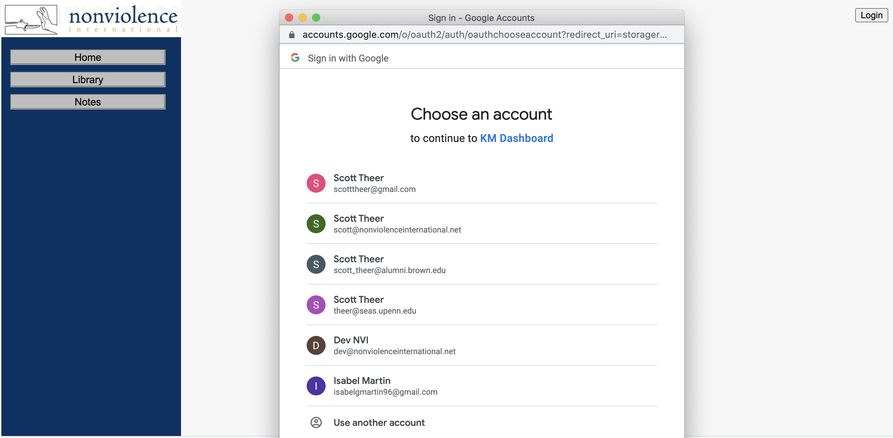
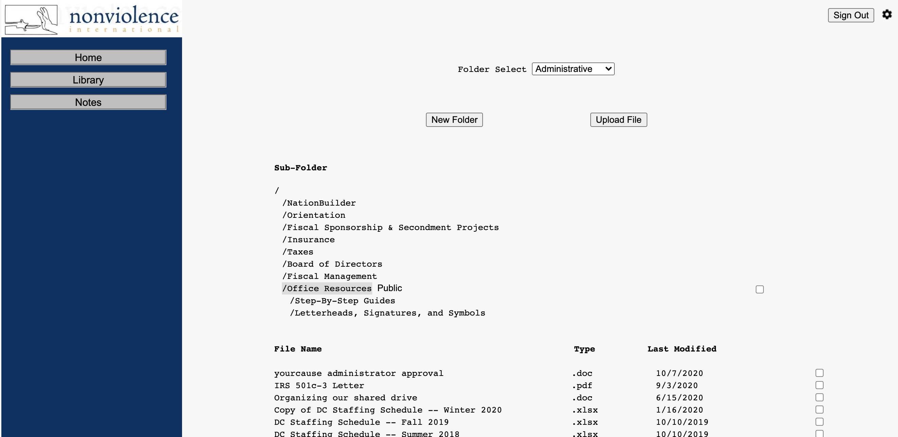
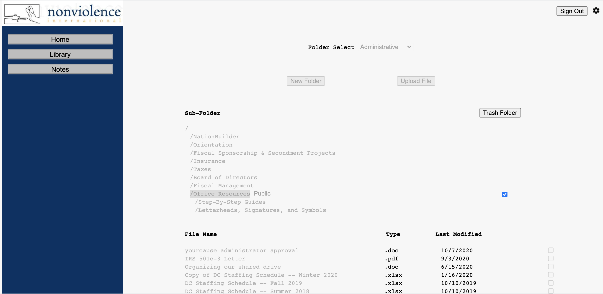
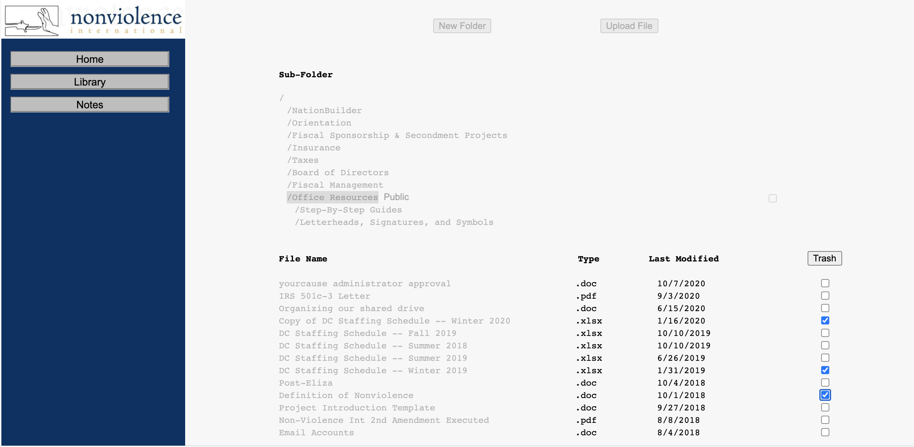
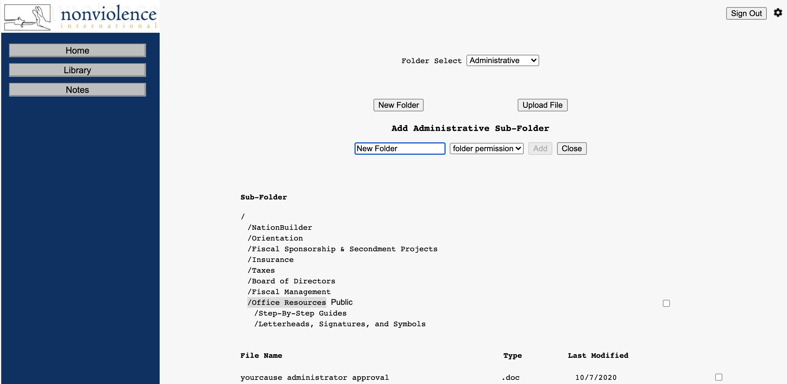
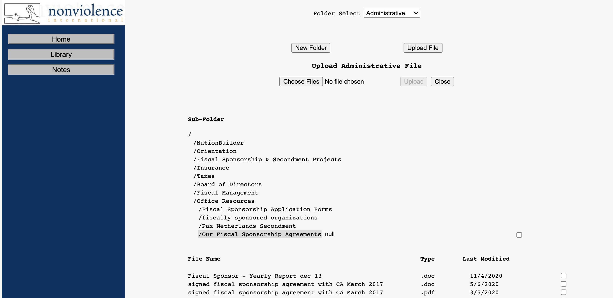
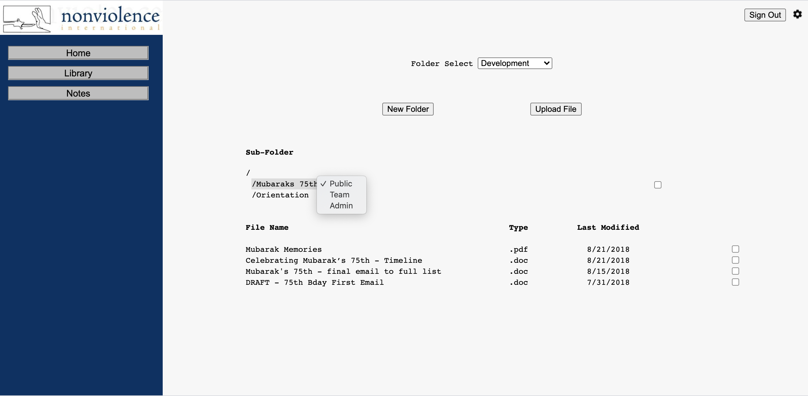
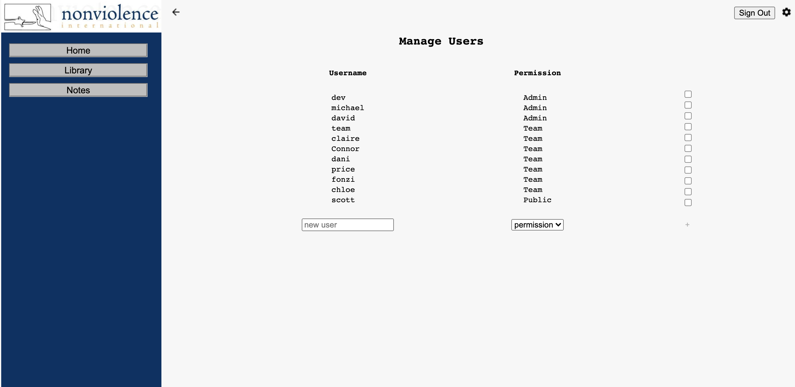
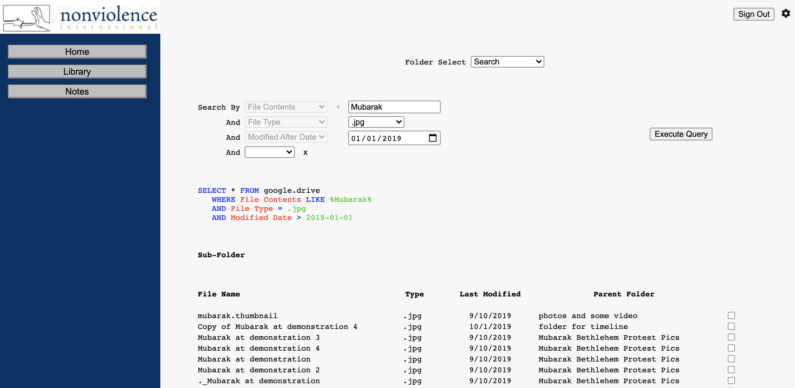

# NVIDashboard

NVITacticsDB is a complete file-system and user-interface supporting all major file-system functionalities, including permissioning. The app was built and is currently in use by Nonviolence International - it is a means of displaying relevant files to entities outside of the organization (e.g. potential donors), as well as serving as knowledge management system. 

The app runs on Flask and SQLAlchemy with Google Drive API integration. The deployed application can be found at https://www.km.nonviolenceinternational.net/ but requires a nonviolenceinternational.net email to access.

## Usage and Images

Site Login

Folder and File System List: Displays subfolder list and contained files. Subfolders can be selected and subsequent subfolders/files are displayed. The subfolder list collapses when a higher-level subfolder is selected. Functionality is therefore analogous to a typical file system.

Folders and Files can be trashed

Folder and Files can be added

Folder permissions can be added. There are three levels of permissions: 'Admin', 'Team', and 'Public.' 'Admin' is only accessible to admin users, 'Team' is accessible to both admin and team users. 'Public' is accessible to all users. A folder permission transfers to all subfiles and folders. A user outside of the organization (e.g. potential donor) is provided an org-specific email (e.g. 'public@nonviolenceinternational.net') tagged with a 'Public' permission - 'Admin' and 'Team' files and folders will not display for these users as they access the site. This feature provides the organization with a level of security and privacy when showing files publicly. Users and permissions are added in the 'Settings' page by 'Admin' users.

Select files can be previewed in the browser, downloaded directly to the client's system, or edited in the browser (given adequate user permissions).

Files can be searched for using a user-selected list of criteria (file name, file contents, file type, folder, modified after date). Searches can therefore be as specific as the user desires. Permissioning still applies to files and folders returned in the search.

## Contributing
This application is closed to contributions.

## License
[MIT](https://choosealicense.com/licenses/mit/)
